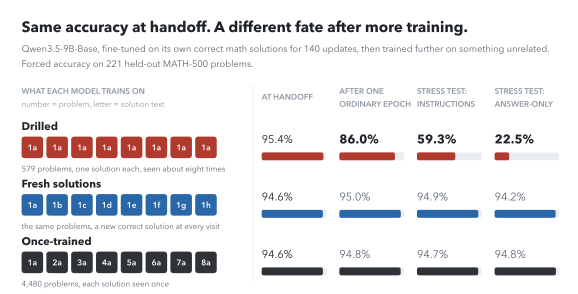
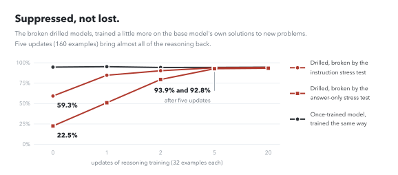

# Fine Until Fine-Tuned: Repeated Solutions Make Reasoning Fragile

[](https://arxiv.org/abs/2609.33559)
[](https://huggingface.co/datasets/Ely2ba/reasoning-durability)
[](LICENSE)

 Made possible by a $5,000 Tinker Research Grant from [Thinking Machines Lab](https://thinkingmachines.ai).

Recipes such as s1 and LIMO teach a model to reason from a thousand worked solutions or fewer, going
over them 5 and 15 times. Judged when that training ends, the repetition looks free. We find that it
leaves the reasoning fragile to whatever training comes next, even training that has nothing to do
with reasoning. This repository holds the code and the frozen data and results; the paper is on
[arXiv](https://arxiv.org/abs/2609.33559).

<p align="center">
  
</p>

<picture>
  <source media="(prefers-color-scheme: dark)" srcset="assets/hero-dark.svg">
  
</picture>

We fine-tuned Qwen3.5-9B-Base on its own correct math solutions in three ways that end up equally
accurate, then trained each a little further on something unrelated. One ordinary epoch of
instruction tuning costs the drilled model 9.6 points more than the once-trained model (95% interval
6.9 to 12.4), and two harsher stress tests take it from 95% to 59% and 23%. The fresh-solution model
visits the same few hundred problems just as often, with a new solution at each visit, and stays within
1.5 points of the once-trained model in every run, so the damage comes from repeating the texts, not
from having few problems. The break recurs with gpt-oss-120b's traces, in two more training runs, on a
second drilled subset, at LoRA rank 128, at 35B, on Nemotron 3 Nano and on an arithmetic search task.

<picture>
  <source media="(prefers-color-scheme: dark)" srcset="assets/recovery-dark.svg">
  
</picture>

The reasoning is suppressed rather than erased. Five updates of reasoning training, 160 examples in
all, bring almost all of it back, and so do twenty updates on the format of reasoning with almost no
mathematics. Fresh solutions prevent the damage, and so does replaying 6.25% of the original solutions
during a gentler later stage. A model sharpened three-quarters as much without repetition was not
fragile, so the repeated texts matter beyond the sharpening they cause. On a skill the base model
cannot perform within a token budget, repetition mostly costs learning instead.

Every number in the paper is written by code from the frozen results in this repository, and one
command rebuilds them all.

## Reproduce the paper's numbers, tables and figures (offline, under a minute)

```
make summaries figures        # outputs/*.csv.gz -> outputs/summaries/*.json -> paper/figures/, assets/
make numbers check            # every number in the text -> paper/numbers.generated.tex, and its check
make test                     # the scorers, the divergence statistics and the recorded numbers
make all                      # all of the above
```

Everything reads `outputs/`, compact per-sample tables with no text (column list in
`outputs/README.md`). Python 3.12 with numpy, pandas and matplotlib (`pip install -r requirements.txt`,
or `pip install -e .`). Without the original runs (`DuraSeed-v1`), `inputs/` and the Hugging Face cache,
`make test` skips the tests that compare the code with the runs that produced the paper (`pytest -m
"not duraseed"` leaves them out).

## Read what the models wrote

The texts behind `outputs/`, every evaluation response and every training solution the models
wrote, are in the Hugging Face dataset
[Ely2ba/reasoning-durability](https://huggingface.co/datasets/Ely2ba/reasoning-durability), with the
third-party prompts removed; its card explains how its rows join `outputs/` and `data/`. The trained
adapters (the Tinker states in `data/checkpoints.json`) are available on request.

## Re-run an experiment (Tinker, costs money)

Install the pinned runtime (`pip install -e ".[experiments]"`), set `TINKER_API_KEY`, rebuild the
third-party inputs from the public datasets (`make inputs`), and give each run a spend limit.

<details>
<summary>The command for each experiment</summary>

| Record | Experiment | Command |
|---|---|---|
| `records/math-pilot.md` | drilled against once-trained on the 9B | `python src/run_math.py --run-id pilot-20260924 --limit 450` |
| `records/main-phase.md` | fresh texts (P), second subset, rank 128 | `python src/run_math.py --run-id main-9b-20260924 --arms P D2 R128 --limit 260` |
| `records/main-phase.md` | 35B and Nemotron replications | `python src/run_math.py --run-id main-35b-20260924 --model Qwen/Qwen3.5-35B-A3B-Base --limit 210`, and `--run-id main-nemotron-20260924 --model nvidia/NVIDIA-Nemotron-3-Nano-30B-A3B-BF16 --limit 180` |
| `records/reforcing.md` | continuation with "Wait" | `python src/run_math.py --run-id pilot-20260924 --reforce M0 D-u140 O-u140 --limit 100` |
| `records/teacher.md` | the same arms on gpt-oss-120b's traces | `python src/run_teacher.py --phase teacher --limit 70`, then `--phase student --limit 210` |
| `records/robustness.md` | early dynamics, learning rate 1e-4, persistence | `python src/run_robustness.py --parts R1 R2 R3 --limit 110` |
| `records/robustness.md` | teacher arms at 1e-4 (R4), a broad non-math chat mix (R5) | `python src/run_robustness.py --run-id robustness-followup-20260924 --parts R4 R5 --limit 80` |
| `records/repetition-fragility.md`, `anchor.md` | TCES drilling and anchors from M0 | `python src/run_tces.py --run-id tces --limit 250 drill` |
| `records/decision-competence.md` | a later stage with probes | `python src/run_tces.py --run-id tces --limit 60 later --states F-u140 --forced 0 20` |
| `records/depth-profile.md`, main-phase N1 | divergence B at 4,096 tokens | `python src/run_tces.py --run-id tces --limit 15 score --states M0 F-u140` |
| `records/revision.md` | RL: relearning after the later stage, with a habit control | `python src/run_revision.py --part RL --limit 175` |
| `records/revision.md` | RP: replay of each arm's own texts during the later stage | `python src/run_revision.py --part RP --limit 40` |
| `records/revision.md` | RS: one epoch of No Robots at the reasoning rate | `python src/run_revision.py --part RS --limit 52` |
| `records/revision.md` | SH: sharpening without repetition | `python src/run_revision_arms.py --part SH --limit 79` |
| `records/revision.md` | SD: seeds, with the drilled subset redrawn | `python src/run_revision_arms.py --part SD --seed s2 --limit 148`, then `--seed s3 --limit 148` |
| `records/revision.md` | SK: a skill the base lacks within 2,048 tokens, in phases reviewed one by one | `python src/run_skill.py --phase smoke --limit 1`, then `--phase calibration --limit 8`, `--phase gate --limit 25` and `--phase rest --limit 100` (the run's cumulative limit) |

</details>

Each run folder, `runs/<family>/<run-id>`, has the paper's run id, which is where `src/collect.py` looks:
the runners default to it, and a command names it when the runner served several of the paper's runs
(`run_math.py`; R4 and R5 ran apart from R1–R3). The TCES runner postdates the paper's TCES runs, so its
commands share one folder of their own, `runs/tces/tces`. The runners that continue earlier runs read them
from `runs/math/` (`--pilot-run`, `--main-run`, `--teacher-run`); SK's synthetic task is `src/common/skill`.

TCES arms train on the RL teacher's samples (the clone corpus) and the anchor on M0's own samples, both
in the Hugging Face dataset (`data/ARCHIVE.md` gives the download and where each file goes). A runner reads a state it did not train from a
state file, `{"state_path": ...}`, where the state's run wrote it (for example
`runs/math/pilot-20260924/train/D/u140-state.json`); `run_tces.py` reads one supplied as
`runs/tces/<run-id>/<label>/state.json` (M0 for `drill`). `src/collect.py` (`make outputs`) turns the runs
tree into `outputs/`; `RUNS` defaults to `../DuraSeed-v1/runs`, the original runs.

## Layout

| Path | What |
|---|---|
| `paper/` | the paper's figures and every number in its text (`numbers.generated.tex`); the paper itself is on [arXiv](https://arxiv.org/abs/2609.33559) |
| `records/` | the pre-registered designs, predictions, deviations and results, verbatim apart from marked redactions, with the prediction ledger and the compute total (`records/README.md`) |
| `data/` | frozen inputs: the TCES panel and Stage-B data, subsets, ids of third-party data, checkpoints |
| `outputs/` | frozen compact results; `summaries/` is regenerated |
| `src/common/` | the TCES verifier, the math scorer, the synthetic skills of SK (`skill/`), model formats, divergence, statistics, Tinker I/O |
| `src/run_*.py` | the experiments; `src/analyze_*.py` the analyses; `src/figures.py` the figures, the README's included, and `src/explainer_gif.py` the explainer's slides |
| `replay-v1/` | the files of the original study's results package that the paper reads (`replay-v1/README.md`) |
| `assets/` | the README's figures, in light and dark; the explainer's 21 slides and the model answers they show (`explainer-responses.json`) |

## Data and licences

Third-party data are stored by id and rebuilt by `src/build_inputs.py`: MATH-500 (MIT),
NuminaMath-TIR via the Tülu 3 SFT mixture (Apache 2.0; ODC-BY), AIME 2025–2026 from MathArena
(CC BY-NC-SA 4.0), No Robots (CC BY-NC 4.0) and, for R5, chat rows of the Tülu 3 SFT mixture (ODC-BY;
each source's own licence). The TCES, program-synthesis and skill tasks are ours. `data/` holds only the ids
of third-party datasets, which stay under their own licences; the Apache-2.0 licence (`LICENSE`)
covers our code, our synthetic tasks and our results.

## Citation

```bibtex
@misc{sheikh2026fine,
  title         = {Fine Until Fine-Tuned: Repeated Solutions Make Reasoning Fragile},
  author        = {Sheikh, Ely},
  year          = {2026},
  eprint        = {2609.33559},
  archivePrefix = {arXiv},
  primaryClass  = {cs.LG},
  url           = {https://arxiv.org/abs/2609.33559}
}
```
